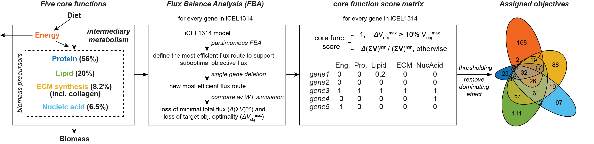

# Compensation/Repression (CR) model
The Compensation/Repression model of transcriptional rewiring of metabolism

## Introduction 
We developped the Compensation/Repression (CR) model to explain the massive and diverse regulation of metabolic genes expression in the metabolic gene Worm Perturb-seq (WPS) dataset. CR model describles a high-level design principle of how metabolism is transcriptionally rewired upon perturbation: at core function level, genes related to the affected core function(s) are up regulated to <ins>compensate</ins> for the perturbation while those related to other core functions are transcriptionally <ins>repressed</ins>. The discovery of CR model relies on Flux Balance Analysis (FBA) using metabolic network model to associate genes with core functions. This repository contains the scripts, data and figures for reproducing CR model analysis reported in our paper. A schematic illustrating the key step, FBA modeling of core functions, is shown below:



For further reading about CR model, please refer to our paper: 
[Systems-level design principles of metabolic rewiring in an animal _Nature_ in press](https://bioRxiv_link)

_Please note that this repository aims for reproducing our study instead of providing a user-friendly package for performing similar analysis on other datasets. Please modify the codes accordingly to build your analysis if a CR-model analysis on other datasets or systems is desired._

## Dependencies 
This analysis invovles a combined use of Matlab and R (> 3.6) platform. The FBA programs were developed and tested in MATLAB R2022b. [COnstraint-Based Reconstruction and Analysis (The COBRA Toolbox)](https://opencobra.github.io/cobratoolbox/stable/) is required to perform the analysis. Check [here](https://opencobra.github.io/cobratoolbox/stable/installation.html) for the installation guidance of COBRA Toolbox. The programs were tested for COBRA Toolbox - 2024 version. If you are using an earlier version of COBRA Toolbox, you may encouter errors related to the field name of the solver return (e.g., "Unrecognized field name "obj""). This might be solved by changing the field name from "obj" to "f" in corresponding places. 

The Linear Program (LP) and Mixed-Integer Linear Problem (MILP) solver used in the study was [gurobi](http://gurobi.com) 10. The built-in solver interface of COBRA Toolbox was used, so that we expect our program to also work with other supported solver in COBRA Toolbox. Please [see here](https://opencobra.github.io/cobratoolbox/stable/installation.html#solver-installation) for furter information about solver availability. 

## Content 
To reproduce the CR-model analysis, run the scripts in the root directory following the numeric order in the suffix of the file name (also the order listed below). The functions of these scripts are described as follows:

_MATLAB_ programs
* __a0_findEssentialExchange.m__: This is a helper function to identify a minimal set of essential exchange reactions that supports all model reactions to carry flux. This script was used to identify such essential exchanges in defining the constraints for a parsimonious nutrient condition for the FBA simulation.
* __a0_save_model_constraints.m__: This is the function to save a fully constrained model into csv files for publication. Provided for reproducibility purpose.
* __a1_gene_obj_classification.m__: The script to perform FBA analysis to calculate the core metabolic function scores and assign core metabolic functions for each model gene.
* __a1_save_rel_del_flux_mat.m__: The script to save the core function scores of each gene into a csv matrix.

_R_ programs
* __2_DEG_modeling_supp_gspd_1_example_objHeatmap.R__: Script to produce the bar plot visualization of core functions of differentially expressed genes (DEGs) in gspd-1 RNAi. Related to **Fig. 4b**. 
* __2_DEG_modeling_basic_CR_model.R__: R script to visualize the differentially expressed genes (DEGs) in metabolic gene WPS dataset with respect to the core metabolic functions. Related to **Fig. 4c**.
* __2_DEG_modeling_supp_excludeMultiObjGenes.R__: Same as __2_DEG_modeling_basic_CR_model.R__ but only analyzed genes with unique core function associations
* __2_DEG_modeling_supp_fused_with_FBA.R__: Testing the FBA-based CR model with the entire metabolic WPS dataset. Related to **Fig. 4f,g**.
* __2_DEG_modeling_supp_GRN_randomization.R__: Same as __2_DEG_modeling_supp_fused_with_FBA.R__ but used alternative randomization method that randomizes the GRN instead of core function associations. Results not shown in the paper but provided for readers' reference.
* __2_DEG_modeling_supp_model_consistency.R__: visualization DEGs and testing CR model significance using the proportion of DEGs consistent with CR model expectation over DEGs with core function(s) associations, instead of over all DEGs. Results not shown in the paper but provided for readers' reference.
* __2_DEG_modeling_supp_parameter_sensitivity_fused_with_FBA.R__: Testing the parameter sensitivity of CR model by titrating the core function score threshold. Related to **Fig. 4h**.
* __3_DEG_modeling_edge_quantification_randFBA.R__: Quantifying the inter-core-function interactions and testing corresponding statistical significance by randomizing core function associations. Related to **Fig. 4d**.
* __3_DEG_modeling_edge_quantification_randGRN.R__: Same as __3_DEG_modeling_edge_quantification_randFBA.R__ but uses randomization of mGRN instead of core function associations. Results not shown in the paper, but support 16 alternative parameter settings mentioned in Supplementary Method to ensure robustness.
* __3_DEG_modeling_edge_direction_test_randFBA.R__: Same as __3_DEG_modeling_edge_quantification_randFBA.R__ but testing an alternative hypothesis that whether the direction of an interaction is significant. Results not shown in the paper, but support 16 alternative parameter settings mentioned in Supplementary Method to ensure robustness.
* __3_DEG_modeling_edge_direction_test_randGRN.R__: Same as __3_DEG_modeling_edge_direction_test_randFBA.R__ but uses randomization of mGRN instead of core function associations. Results not shown in the paper, but support 16 alternative parameter settings mentioned in Supplementary Method to ensure robustness.
* __4_supplementary_analysis.R__: Reproducing the numbers (i.e., enrichment of genes associated with core functions in mGRN) reported in the paper.

_Folders_
* __input__: inputs for CR model analysis
* __output__: pre-stored outputs of modeling results. Used for making the figures in the paper.
* __figures__: raw figures used for making the paper. These figures were the input for final figure making in Illustrator.
* __helper_scripts__: helper functions in FBA analysis 
  * __addDefaultConstraint.m__: Constraining the metabolic network model for performing FBA.
  * __listRxn4gene.m__: a helper reactions to track flux distributions related to a given gene. Only useful for developers who wants to look deep into the FBA results in core function simulations.
  * __iMAT_xl.m__: script to run iMAT algorithm, which was used in determining the essential exchange reactions.
  * __solveCobraMILP_XL.m__: custom solver interface used in ```iMAT_xl```. 
* __REVISION__: additional analyses performed during paper revision. The major efforts here are to extend CR model analysis to Perturb-seq data from human cells. The file names and organizations are identical to that for the _C. elegans_ analysis. 

We tried our best to ensure the codes are well commented and readable. However, if you encounter any questions, please feel free to reach out (see below for __Contacts__)!

**_Please be advised that a few large files (some input and output files) cannot be uploaded into Github repo. These files were listed in the .gitignore file and are available at [Zenodo](10.5281/zenodo.14237197) for download_**

## Reproducing the figures 
To faciliatate rigorous reproduction of a specific figure, we provided the original working directory of this project with figure-by-figure annotations. Please refer to [our Zenodo depository](https://doi.org/10.5281/zenodo.14198997) for this purpose. This Github serves as an alternative to quickly get started on the core CR model analysis. 

## Contact

Any questions or suggestions on reproducing CR model analysis or testing it in other systems/datasets are welcomed! Please contact Xuhang Li [xuhang.li\@umassmed.edu](mailto:xuhang.li@umassmed.edu) for questions!
